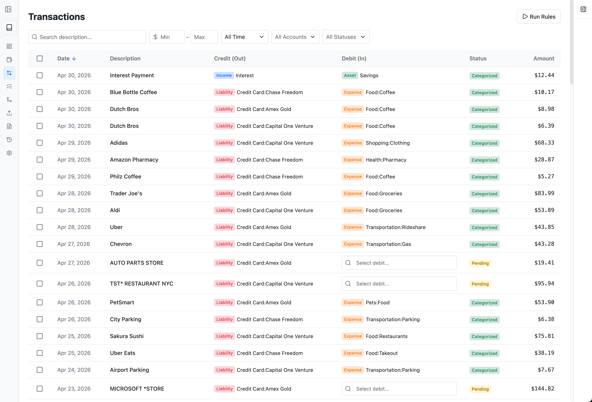
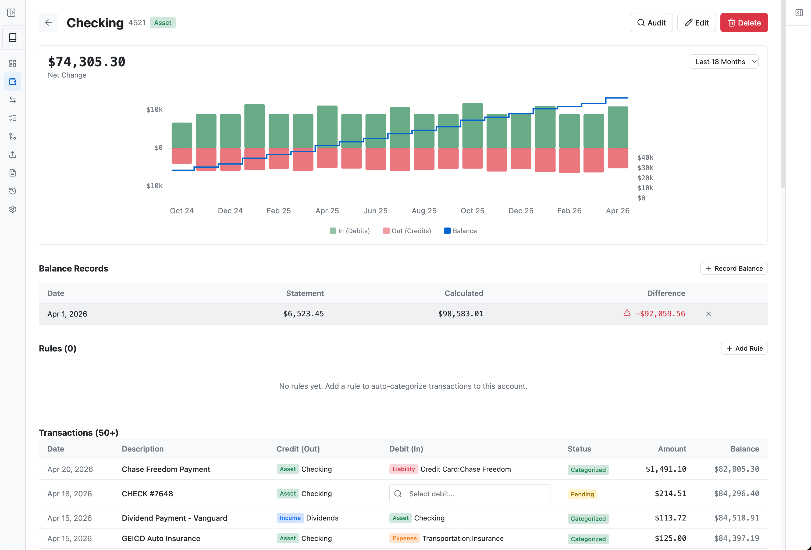
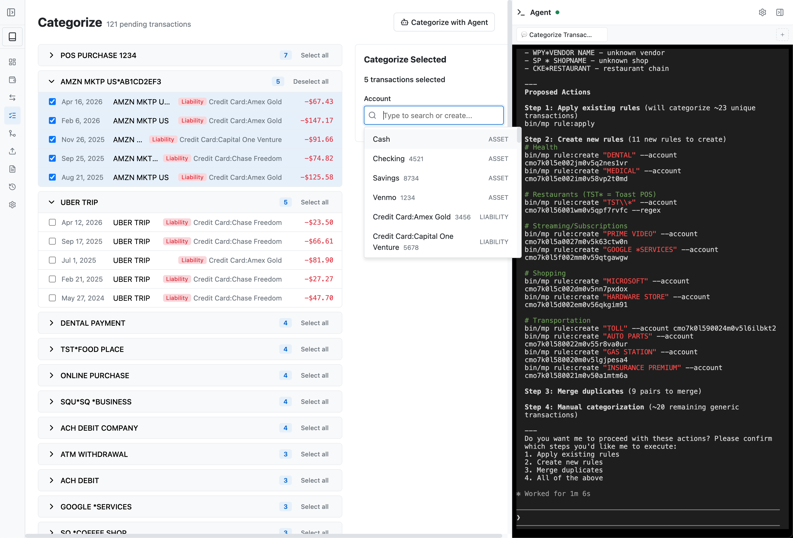
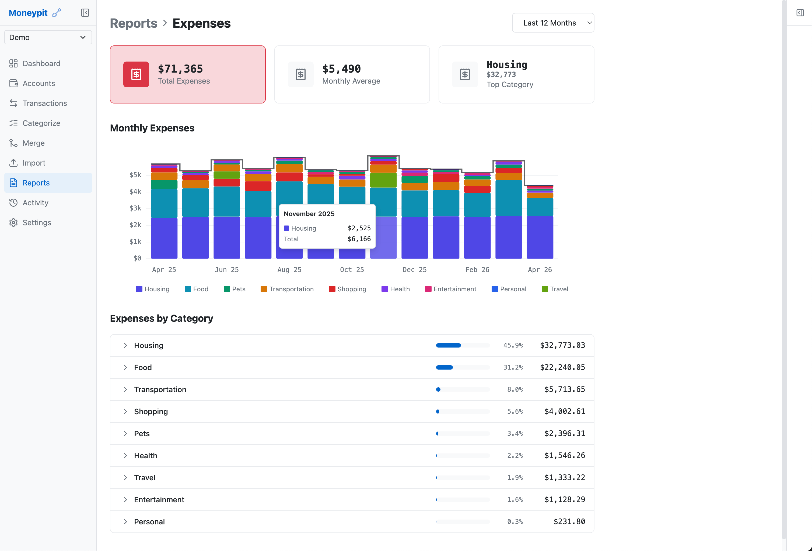

# Moneypit

A double-entry bookkeeping web app for personal finance and self-employment tax tracking. Leverages agents of your choice to help you manage and make sense of your accounts.

## Features

- **Double-entry bookkeeping** - Every transaction has a debit and credit account



- **Hierarchical accounts** - Organize with paths like `Business:Hosting` or `Utilities:Electric`



- **Bank import** - Import OFX/QFX files and CSV exports from major banks
- **Auto-categorization** - Create rules to automatically categorize transactions; dedicated page and agentic categorization make this faster



- **Duplicate detection** - Find and merge duplicate transfers across accounts
- **Tax tracking** - Link accounts to IRS schedule references
- **Undo support** - Operation log with undo capability
- **CLI interface** - `bin/mp` commands for scripting and AI agent integration
- **Agent assist** - use your favorite coding agent to help categorize your accounts and figure out what should go where
- **Reports** - Run reports to understand Net Worth, Expenses, and Taxes



- **Multiple books** - keep your personal and corporate books separate

## Tech Stack

- **Frontend**: SvelteKit, Svelte 5, TypeScript
- **Database**: PostgreSQL + Prisma
- **CLI**: `bin/mp <command>` for database operations

## Getting Started

### Prerequisites

- [Bun](https://bun.sh) 1.0+
- PostgreSQL 14+

### Setup

```bash
# Install dependencies
bun install

# Create database
./scripts/create-local-db.sh moneypit moneypit

# Push schema to database
bun run db:push

# Start dev server
bun run dev
```

The app runs at http://localhost:5180

## Development

```bash
bun run dev        # Start dev server
bun run check      # TypeScript + Svelte type checking
bun run lint       # ESLint
bun run db:studio  # Prisma Studio (database GUI)
```

### Database Changes

```bash
bun run db:push      # Apply schema.prisma changes to database
bun run db:generate  # Regenerate Prisma client
```

## Testing

Tests use [Bun's test runner](https://bun.sh/docs/cli/test) for fast execution.

```bash
./scripts/test.sh        # Run all tests (unit + e2e)
./scripts/test.sh unit   # Run only unit tests (fast, no database)
./scripts/test.sh e2e    # Run only e2e tests (requires test database)

# Or via bun scripts
bun test                 # Run all tests
bun run test:unit        # Run only unit tests
bun run test:e2e         # Run only e2e tests
```

### Test Database Setup

E2E tests run against a separate test database to avoid touching production data:

```bash
# Create test database (one-time setup)
./scripts/create-local-db.sh moneypit_test moneypit_test
```

## CLI

The `bin/mp` CLI provides commands for all database operations. This is also how AI agents interact with Moneypit.

```bash
bin/mp help              # See all commands

# Books
bin/mp book:list         # List all books
bin/mp book:switch <id>  # Set default book

# Accounts
bin/mp account:list      # List accounts [--type <type>]
bin/mp account:tree      # Show account hierarchy
bin/mp account:create    # Create account --type <type> --path <path>

# Transactions
bin/mp tx:list           # List transactions [--account <id>] [--status <status>]
bin/mp tx:uncategorized  # Show pending transactions
bin/mp tx:categorize     # Categorize transactions <ids...> --debit <id> or --credit <id>

# Import
bin/mp import:ofx <file> --account <id>
bin/mp import:csv <file> --account <id> --mapping '<json>'

# Rules
bin/mp rule:list         # List all rules
bin/mp rule:create       # Create rule <pattern> --account <id>
bin/mp rule:apply        # Apply rules to pending transactions

# Tax
bin/mp tax:list          # List tax categories
bin/mp module:list       # List available tax modules
bin/mp module:enable     # Enable a tax module

# Utilities
bin/mp log:list          # Show recent operations
bin/mp log:undo <id>     # Undo an operation
bin/mp demo:create       # Create demo book with sample data
```

## Project Structure

```
moneypit/
├── bin/mp                    # CLI executable
├── prisma/schema.prisma      # Database schema
├── scripts/
│   ├── mp.ts                 # CLI implementation
│   └── test.sh               # Test runner
├── src/
│   ├── lib/
│   │   ├── server/
│   │   │   ├── db.ts         # Prisma client
│   │   │   ├── actions/      # Server actions
│   │   │   └── import/       # OFX/CSV parsers
│   │   └── components/       # Svelte components
│   └── routes/               # SvelteKit pages
└── test/
    ├── unit/                 # Unit tests
    └── e2e/                  # E2E tests
```

## Telemetry

Moneypit does not have any telemetry, analytics, or usage data. Your financial data stays entirely on your local machine. There is no authentication built in, so putting this on the internet or any public address is not a good idea.

If you use the built-in agent panel, the data you see in the thread will be sent to whichever AI provider you use. If you want to use Moneypit but don't want to share any data with these AI companies, don't use the agent panel, or configure it to use a local model.

## Disclaimer

Moneypit is provided as-is for personal use. It is not a substitute for professional accounting or tax advice. Always consult a qualified accountant or tax professional for financial decisions. The authors are not liable for any errors, omissions, or financial losses resulting from the use of this software.

## License

MIT. Copyright (c) 2026 Andrew Childs.
